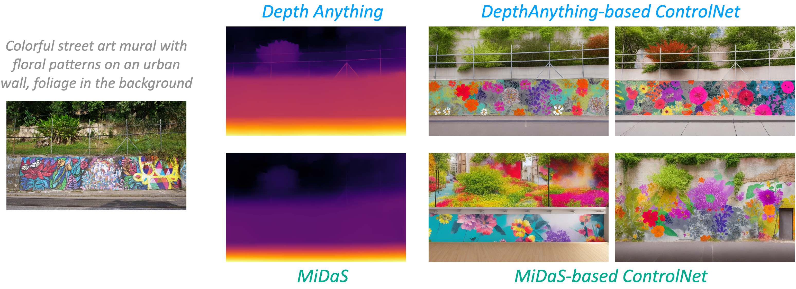

## Depth-Conditioned ControlNet based on Depth Anything

We use [Diffusers](https://github.com/huggingface/diffusers/tree/main) to re-train a better depth-conditioned ControlNet based on our Depth Anything.

Please download our [config file](./config.json) and [pre-trained weights](https://huggingface.co/spaces/LiheYoung/Depth-Anything/tree/main/checkpoints_controlnet), then follow the [instructions](https://github.com/huggingface/diffusers/tree/main/examples/controlnet) in Diffusers for inference. 

## Depth-to-Image Synthesis

## Video Editing

Please refer to our [project page](https://depth-anything.github.io/). We use [MagicEdit](https://github.com/magic-research/magic-edit) to show demos of video editing based on depth information.
